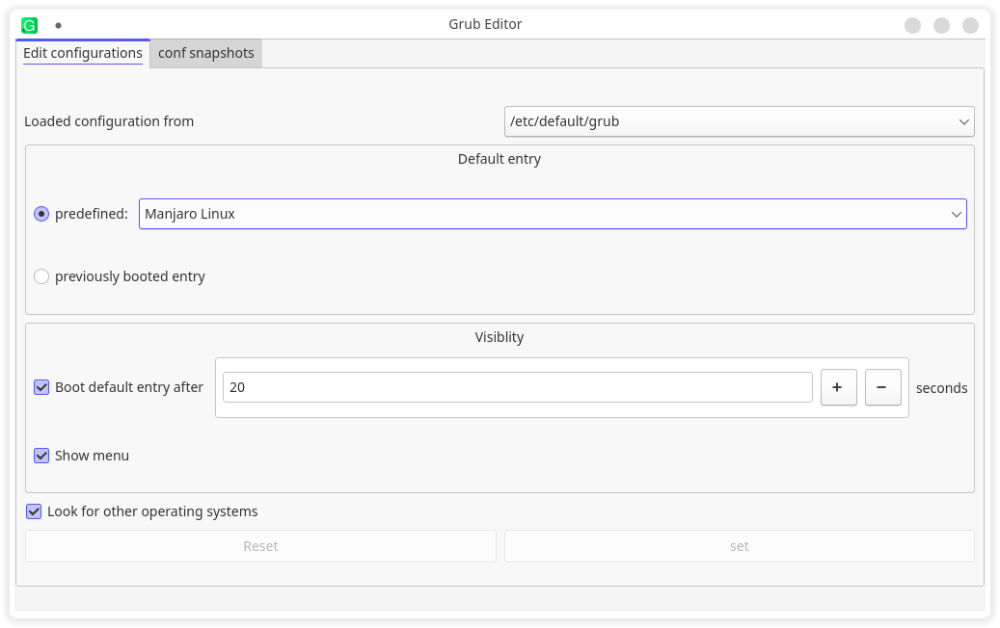
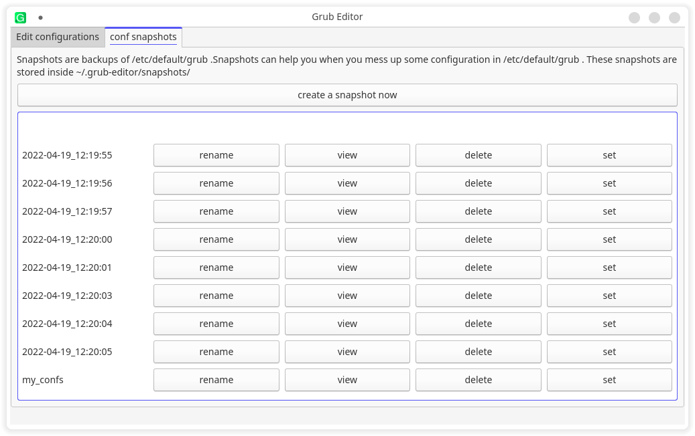

# grub-editor

GUI application to manage grub configuration

It workes by editing the /etc/default/grub

[Website](https://grub-editor.herokuapp.com)

# snapshots storage

Snapshots of the configs are stored in ~/.local/share/grub-editor/snapshots/